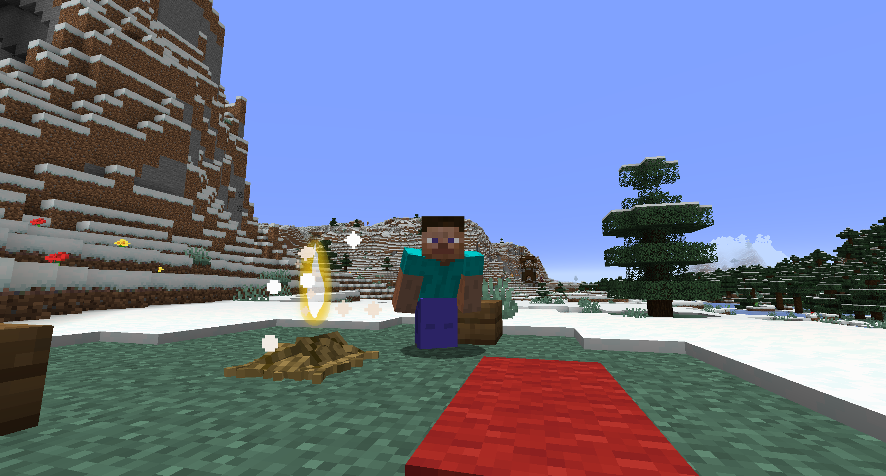

# LostGrace
<!-- ALL-CONTRIBUTORS-BADGE:START - Do not remove or modify this section -->

<!-- ALL-CONTRIBUTORS-BADGE:END -->

Entries of [Teacon 2022](https://www.teacon.cn/2022/index)

See [TODO](./doc/TODO.md) to track our progress.

The call of long lost grace speaks to us all.

## Contributors ✨

Thanks goes to these wonderful people ([emoji key](https://allcontributors.org/docs/en/emoji-key)):

<!-- ALL-CONTRIBUTORS-LIST:START - Do not remove or modify this section -->
<!-- prettier-ignore-start -->
<!-- markdownlint-disable -->
<table>
  <tr>
    <td align="center"><a href="http://N/A"> <b>shagejack.eth</b></a> <a href="#ideas-ShageJack" title="Ideas, Planning, & Feedback">🤔</a> <a href="https://github.com/ShageJack/LostGrace/commits?author=ShageJack" title="Code">💻</a></td>
    <td align="center"><a href="https://github.com/MalayPrime"> <b>MalayP</b></a> <a href="#design-MalayPrime" title="Design">🎨</a></td>
  </tr>
</table>

<!-- markdownlint-restore -->
<!-- prettier-ignore-end -->

<!-- ALL-CONTRIBUTORS-LIST:END -->

This project follows the [all-contributors](https://github.com/all-contributors/all-contributors) specification. Contributions of any kind welcome!